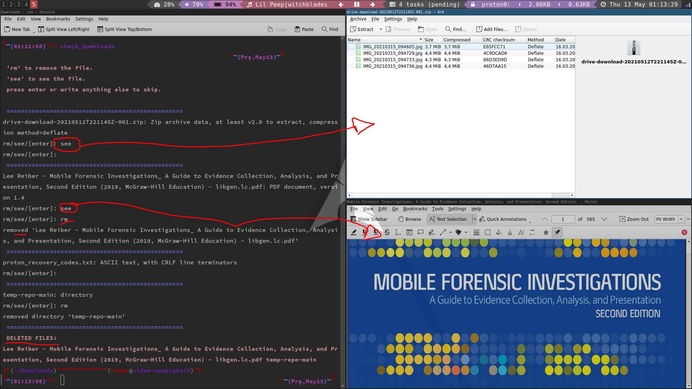

## Script List

[git_scripts](https://github.com/panicwithme/my_scripts/tree/master/git_scripts)
- **git_pull.sh:** executes "git pull" command in each directory in the $DIR directory.
- **merge_upstream.sh:** merges upstream repositories into your fork repos.
- **set_origin.sh:** this script executes sets remote origin in each local repo in the $DIR directory. I use this script to switch URLs from HTTPS to SSH.

[misc_scripts](https://github.com/panicwithme/my_scripts/tree/master/misc_scripts)
- **check_downloads.sh:** loops through a directory. for each file it asks if you want to remove the file/dir. you can also see the content of the file/dir. it is useful for me since my downloads file gets cluttered frequently.
	
